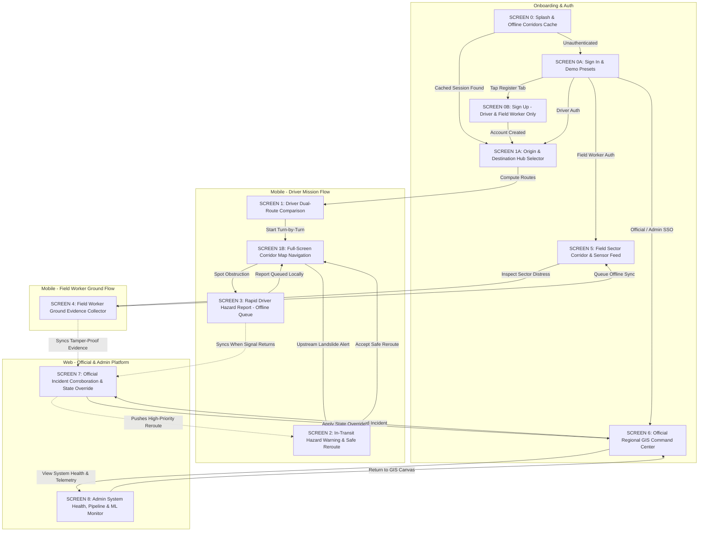

# TiyraSense — Google Stitch Master Prompt Pack

**Project:** TiyraSense — AI-Powered Smart Logistics & Accessibility Intelligence Platform for the North Eastern Region (NER)  
**Theme:** Crisp Light Mode (Tactical Decision-Support Aesthetic)  
**Mobile Viewport:** `390 x 844 px` · **Web / Desktop Viewport:** `1440 x 900 px`  
**Brand Colors:** Brand Navy (`#152238`) & Brand Teal (`#0E9C8C`)  

---

## 0. Reference Image Mapping & Extraction Guide

Google Stitch allows attaching reference images alongside text prompts to extract layout structures, component hierarchies, and spacing rhythms. When generating in Stitch, attach the reference image designated for each screen.

> [!IMPORTANT]
> **Do NOT copy color palettes or soft pastel gradients from reference images 2, 3, 4, and 5.**  
> Extract **layout, component hierarchy, card rhythm, and tap targets only**. All screens must strictly adhere to the TiyraSense **Crisp Light Tactical Theme** tokens defined in Section 1.

| Reference Asset | File Name | Primary Role in Stitch Generation | What to EXTRACT (Keep) | What to DISCARD (Do NOT Use) |
|---|---|---|---|---|
| **Image 1** | `TiyraSense.svg` / `TiyraSense.png` | **Official Brand Mark**<br>Attach to **ALL** screens | Exact dual-tone glyph: Navy bird-head/flowing-tail interlocking with Teal wing/wave hook to form stylized "T". Wordmark typography. | N/A — Brand mark colors (`#152238` & `#0E9C8C`) are canon. |
| **Image 2** | `login.webp` | **Authentication & Onboarding Architecture**<br>(Screens 0, 0A, 0B) | Vertical rhythm: full-bleed top art leading into grounded white card sheet; segmented pill tabs (`Log In` / `Sign Up`); password visibility toggles; terms checkbox; primary pill action button. | Soft lilac, pink, and peach pastel gradients. |
| **Image 3** | `app.webp` | **Dynamic Hub Selector & Cards**<br>(Screens 1, 1A, 3, 5) | "Find Your Best Trip" Origin/Destination selector card with swap icon; category pill strip; departure date/cargo specs; Search Results route comparison cards; boarding-pass manifest card with barcode/QR verification strip. | Lavender/mint backgrounds, candy-colored icons. |
| **Image 4** | `signup.webp` / `sogn up.webp` | **Role-Restricted Registration Architecture**<br>(Screen 0B) | Structured multi-field registration form sheet; name, email, phone, password fields; role picker container; legal consent footer. | Green neon gradient background; circular beauty logo. |
| **Image 5** | `mapview.webp` | **Corridor GIS & Navigation Viewport**<br>(Screens 1, 1B, 2, 6) | Full-bleed interactive vector hill map; top horizontal filter chips (`All`, `Passable`, `Caution`); circular hazard radar halos; floating bottom ETA summary cards docked over map. | Teal/mint tint and consumer salon branding. |

---

## 1. Global Light Theme Design System (DESIGN.md Specification)

*(Apply these tokens into Stitch's Project Constitution / Design System settings before generating screens.)*

### Visual Atmosphere & Principles
- **Aesthetic:** Tactical operational command center meets Scandinavian precision. High-contrast, clean, clinical yet human-accessible.
- **Density:** High-density balanced (7.5/10). Precise data tables, micro-pill indicators, telemetry metrics, split map-card layouts.
- **Background:** Canvas White (`#F8FAFC`) with subtle cool slate tint. Elevated surfaces are Pure White (`#FFFFFF`) with 1px hairline borders (`#E2E8F0`).
- **Typography:** Sans-Serif pairing (`Geist` or `Outfit` for display/body, `Geist Mono` or `JetBrains Mono` for coordinates, timestamps, sensor feeds, and road segment IDs).
- **Brand Mark:** Use the attached logo (Image 1) verbatim in Brand Navy / Brand Teal wherever the TiyraSense wordmark or icon appears — never recolor it.
- **Core Three-Concept Risk Separation (Mandatory on every route/segment display):**
  1. *Current Accessibility:* `OPEN` | `CAUTION` | `RESTRICTED` | `HIGH_RISK` | `BLOCKED`
  2. *Disruption Probability:* Continuous ML percentage ($0\% - 100\%$) with time horizon (e.g. `24% in next 2h`)
  3. *Route Risk:* Composite score (`LOW` | `MODERATE` | `HIGH` | `CRITICAL`)
- **Data Provenance Badging:** Every telemetry card, prediction panel, and alert shows an uppercase micro-pill: `[LIVE]`, `[HISTORICAL]`, `[SIMULATED]`, or `[TEST]`.
- **RBAC Self-Service Restriction:** Registration is strictly restricted to **Driver** and **Field Worker**. Officials and Administrators are provisioned solely by backend database administrators.

### Color Palette Tokens
| Token Name | Hex Code | Role & Usage |
|---|---|---|
| **Canvas Background** | `#F8FAFC` | Page body, canvas base, outer margins |
| **Surface Card** | `#FFFFFF` | Cards, modals, bottom sheets, navigation bars |
| **Surface Subtlety** | `#F1F5F9` | Secondary containers, table headers, input fields |
| **Border Hairline** | `#E2E8F0` | 1px card outlines, divider lines |
| **Border Strong** | `#CBD5E1` | Active input borders, focused boundaries |
| **Text Primary** | `#0F172A` | Slate-900 high contrast for headlines and critical data |
| **Text Secondary** | `#475569` | Slate-600 for descriptions, secondary labels |
| **Text Muted** | `#64748B` | Slate-500 for timestamps, metadata, units |
| **Primary Blue** | `#0284C7` | Primary CTAs, active tabs, route polylines |
| **Primary Hover** | `#0369A1` | Darker active-state blue |
| **Primary Light** | `#F0F9FF` | Selected-state background tint |
| **Status Open** | `#10B981` | Passable — emerald badge, text, and map polyline |
| **Status Caution** | `#F59E0B` | Weather or speed advisories — amber badge |
| **Status Restricted** | `#F97316` | Lane, axle, or load limits — orange badge |
| **Status High Risk** | `#DC2626` | Active rockfalls, heavy mudslides — crimson badge |
| **Status Blocked** | `#991B1B` | Road closures, full collapse — ruby badge |
| **Brand Navy** | `#152238` | TiyraSense logo dark stroke, header titles |
| **Brand Teal** | `#0E9C8C` | TiyraSense logo teal accent |

### Anti-Patterns (Strictly Banned)
- No emojis anywhere in the UI (SVG outline icons only).
- No pure black (`#000000`) — use Deep Slate (`#0F172A`).
- No neon glowing borders or oversaturated gradients.
- No generic serif fonts.
- No single generic "AI Risk Score" — always show the three-concept risk separation.
- The LLM is shown only authoring text explanations and multilingual advisories — never deciding routes.

---

## 2. Interactive Screen Connection Architecture



---

## 3. Screen Generation Prompts for Google Stitch

Generate screens in logical operational sequence:
**Screen 0 → 0A → 0B → 1A → 1 → 1B → 2 → 3 → 4 → 5 → 6 → 7 → 8**

---

### SCREEN 0: Splash & System Initialization
- **Target Platform:** Mobile (`390 x 844 px`)
- **Attach:** Image 1 (`TiyraSense.svg`) + Image 2 (`login.webp`, for vertical proportions)
- **User Persona:** All users upon cold start.
- **Primary Goal:** Display verified branding while the app verifies offline SQLite cache, acquires GPS lock, and checks cloud gateway connectivity.

```text
Create a clean, tactical splash and initialization screen for TiyraSense in light mode (390x844px).

Visual Style & Atmosphere:
- Full-bleed Canvas White (#F8FAFC) background. High precision, clinical Scandinavian aesthetic.
- Centered brand lockup: TiyraSense dual-tone logo (Brand Navy #152238 and Brand Teal #0E9C8C) generously sized (76x76px).
- Wordmark "TiyraSense" in bold Geist/Outfit (#0F172A), followed by the subtitle "NER Logistics & Accessibility Intelligence Platform" (#475569).
- Vertical proportions inspired by login.webp (centered hero brand area giving way to a structured lower initialization panel).

Screen Structure:
1. Center Stage (top 55%):
   - Crisp TiyraSense logo mark and typography.
   - Subtitle with small-caps tracking: "AI-POWERED DECISION SUPPORT • SIH 2026".

2. System Initialization Panel (lower 35%, Surface Card #FFFFFF with 1px hairline border #E2E8F0, rounded top corners 24px):
   - Panel Header: "INITIALIZING MISSION CONSOLE" with a live pulsing emerald dot (#10B981).
   - 3 sequential checklist rows with trailing badges:
     * "Verifying offline corridor cache" — [1,248 SEGMENTS CACHED] in emerald pill badge (#ECFDF5 bg, #059669 text).
     * "Acquiring GPS fix" — [±4M ACCURACY] in blue pill badge (#F0F9FF bg, #0284C7 text).
     * "Syncing IMD & CWC flood telemetry" — [SYNCED: 4M AGO] in slate pill badge (#F1F5F9 bg, #475569 text).
   - Slim progress bar across bottom of panel in Primary Blue (#0284C7).

3. Footer:
   - "TiyraSense v2.4 • [PRODUCTION-PILOT] • Offline-First Engine Active" (#64748B, Geist Mono, 10px).
   - No buttons; screen auto-advances to authenticated route or Sign In.
```

---

### SCREEN 0A: Authentication — Sign In Console & Demo Presets
- **Target Platform:** Mobile (`390 x 844 px`)
- **Attach:** Image 1 (`TiyraSense.svg`) + Image 2 (`login.webp`, right screen structure)
- **User Persona:** Logistics Driver, Field Inspector, Official, or Admin signing in.
- **Primary Goal:** High-trust login with persistent session checkbox, email/password fields, and quick-fill demo presets.

```text
Create a tactical, high-contrast mobile Sign In screen for TiyraSense in light mode (390x844px).

Visual Style & Atmosphere:
- Canvas White background (#F8FAFC). High readability, crisp 1px borders (#E2E8F0).
- Pure White card container (#FFFFFF) holding inputs and controls.
- Reference the right screen of login.webp for the segmented pill toggle and vertical input rhythm.

Screen Structure:
1. Top Brand Header:
   - Compact TiyraSense logo mark (Brand Navy/Teal) beside wordmark "TiyraSense".
   - Tactical mission pill: "NER TRANSPORT INTELLIGENCE // SECURE GATEWAY".

2. Segmented Mode Switcher (Pill style):
   - Two tabs: "Sign In" (Selected: solid Primary Blue #0284C7, white text) | "Create Account" (Unselected: transparent, #64748B text).

3. Credentials Input Card:
   - "Registered Email": input field with envelope outline icon, pre-filled with "driver@tiyrasense.in".
   - "Access Password": input field with lock outline icon, masked dots with eye visibility toggle.
   - Options Row: Checkbox "Keep me signed in on this device" (checked by default, explaining "Session encrypted via Hardware Keystore") and right-aligned link "Forgot Password?".

4. Primary Action:
   - Full-width pill button (52px height) in Primary Blue (#0284C7), white bold text: "SIGN IN TO TIYRASENSE".

5. Quick Demo Presets Card (Surface Subtlety #F1F5F9, 1px border #CBD5E1, rounded 14px):
   - Header row: "DEMO TEST PROFILES (ONE-TAP FILL)" with key icon.
   - 4 selectable tactical chips in 2x2 grid:
     * [Truck Icon] "Driver (Ramen Kalita)" • NH-06 Heavy Freight
     * [Badge Icon] "Field Worker (P. Hazarika)" • Meghalaya Sector
     * [Shield Icon] "Official (ASDMA / SDMA)" • State Command
     * [Terminal Icon] "System Admin (NEC)" • Infrastructure Root

6. Micro-footer:
   - "Encrypted via AES-GCM-256 • Hardware Enclave Bound • Strict Server RBAC Enforced".
```

---

### SCREEN 0B: Authentication — Role-Restricted Registration
- **Target Platform:** Mobile (`390 x 844 px`)
- **Attach:** Image 1 (`TiyraSense.svg`) + Image 4 (`signup.webp`, form layout reference)
- **User Persona:** New Commercial Driver or Field Worker joining the platform.
- **Primary Goal:** Self-service registration strictly enforcing SIH rule: Only Driver & Field Worker roles allowed.

```text
Create an authoritative self-registration screen for TiyraSense in light mode (390x844px).

Visual Style & Atmosphere:
- Tactical Light Theme (#F8FAFC base, #FFFFFF cards, #E2E8F0 borders).
- Form structure inspired by signup.webp, reskinned completely in TiyraSense slate/navy/blue palette.

Screen Structure:
1. Header:
   - Back arrow button. TiyraSense logo mark with headline "Join TiyraSense Network".
   - Subhead: "Register your transport unit or field deployment".

2. Mandatory Role Selector (SIH Policy Notice):
   - Warning banner (#FEF3C7 bg, #D97706 border): "Notice: Self-service registration is strictly restricted to Drivers and Field Workers. Official & Admin access is provisioned via government administrator orders only."
   - 2 Radio Card options:
     * Card 1 (Selected, #F0F9FF bg, #0284C7 border, checkmark):
       "Commercial Freight Driver" — "Heavy freight, regional transit, emergency supply delivery."
     * Card 2 (Unselected, #FFFFFF bg, #E2E8F0 border):
       "Field Inspection Worker" — "PWD, road patrol, hazard reporter, ground evidence verifier."

3. Account Details Inputs:
   - "Full Legal Name" (e.g. "Biren Roy")
   - "Registered Email" (e.g. "biren.freight@tiyrasense.in")
   - "Mobile Number" with country code "+91" prefix
   - "Vehicle Number / Field Worker ID" (e.g. "AS-01-GB-4190")
   - "Password" and "Confirm Password" fields

4. Legal Consent & Submit:
   - Checkbox: "I certify that I am an authorized commercial carrier or field worker in the North Eastern Region."
   - Full-width button (52px height) in Deep Navy (#0F172A), white text: "REGISTER VERIFIED ACCOUNT".
   - Link: "Already registered? Sign In".
```

---

### SCREEN 1A: Origin & Destination Corridor Journey Planner
- **Target Platform:** Mobile (`390 x 844 px`)
- **Attach:** Image 1 (logo) + Image 3 (`app.webp`, center "Find Your Best Trip" screen)
- **User Persona:** Driver or Fleet Dispatcher planning a journey through NER hill corridors.
- **Primary Goal:** User dynamically selects Origin, Destination, Vehicle Specs, and Cargo Sensitivity before computing candidate routes.

```text
Create an intuitive hill-corridor journey planning screen for TiyraSense in light mode (390x844px).

Visual Style & Atmosphere:
- Clean light mode layout inspired by the center "Find Your Best Trip" screen in app.webp.
- Tactile white card floating over a subtle topographical map preview.
- Crisp hairline borders (#E2E8F0), prominent blue interactive elements (#0284C7).

Screen Structure:
1. Top Navigation Bar:
   - Left: Profile avatar "Ramen Driver • Heavy Freight".
   - Right: [LIVE WEATHER SYNC] pill badge with emerald indicator.

2. Corridor Journey Configuration Card (Pure White #FFFFFF, rounded 20px, drop shadow):
   - Card Header: "PLAN CORRIDOR PASSAGE" with mountain-road icon.
   - Mode Toggle: "Single Corridor" (Selected) | "Multi-Drop Logistics"
   - Origin Hub Input ("From"):
     * Green start pin icon. "Guwahati (Beltola Logistics Park) — Assam".
     * Micro-tag: "Hub Elevation: 55m • Weather: Clear 28°C".
   - Vertical dotted connection line with circular "Swap Hubs" button on right (#F1F5F9 bg, blue arrows).
   - Destination Hub Input ("To"):
     * Red destination pin icon. "Shillong (Mawlai Terminal) — Meghalaya".
     * Micro-tag: "Hub Elevation: 1,520m • Weather: Heavy Rain Watch".
   - Departure Schedule:
     * Calendar icon: "Departure: Today, 15:00 IST (Immediate)".
   - Freight & Vehicle Specifications:
     * Vehicle Type: "14-Wheeler Heavy Freight (4-Axle • 28 Ton GVW)".
     * Cargo Category: "Perishable Medicine & Cold Storage [CRITICAL TIER 1]".

3. Quick Corridor Presets (horizontal swipeable chips):
   - [Guwahati -> Shillong (NH-06)] (Active)
   - [Silchar -> Aizawl (NH-306)]
   - [Dimapur -> Kohima (NH-29)]
   - [Jorhat -> Itanagar (NH-415)]

4. Primary Call to Action:
   - Full-width button (54px) in Primary Blue (#0284C7) with white bold text:
     "EVALUATE VIABLE CORRIDORS & RISK"
   - Subtext: "Computes Safest vs Fastest candidates via OSRM + Real-Time Disruption Model."
```

---

### SCREEN 1: Driver Mission Control & Dual-Route Safe Navigation
- **Target Platform:** Mobile (`390 x 844 px`)
- **Attach:** Image 1 (logo) + Image 3 (`app.webp`, "Search Results" comparison card layout)
- **User Persona:** Freight Driver reviewing candidate routes computed by the risk engine.
- **Primary Goal:** Compare "Recommended Safest" vs "Fastest Available" with strict risk separation, terrain gradients, and passability scores.

```text
Create a high-precision route evaluation screen for TiyraSense Logistics Driver in light mode (390x844px).

Visual Style & Atmosphere:
- Clean, tactile light theme (#F8FAFC base, #FFFFFF cards, #E2E8F0 borders).
- Route comparison card hierarchy inspired by the Search Results in app.webp.
- Numbers and telemetry in Geist Mono. Strict risk separation (Accessibility, Disruption %, Route Risk).

Screen Structure:
1. Top Operational Bar:
   - TiyraSense logo with "[LIVE] ONLINE" pill.
   - Vehicle Chip: "Heavy Freight • 28 Ton" • Offline Cache: "NH-06 Cached (Valid)".

2. Corridor Route Summary:
   - "Guwahati (Beltola) -> Shillong (Mawlai) • 98 km via NH-06"
   - Weather: "Rain 18 mm/h • Soil Saturation 82% (High) at Nongpoh Pass".
   - State Badge: "Corridor State: CAUTION (Monsoon Advisory Active)".

3. Embedded Vector Map Preview (Height 260px):
   - NH-06 winding hill corridor with two colored route polylines:
     * Route A (Direct GS Road): Amber (#F59E0B) with rockfall caution marker.
     * Route B (Umsning Bypass): Solid Emerald (#10B981) avoiding the hazard.
   - Elevation overlay: "940m Altitude • Max Slope 9.2%".

4. Route Comparison Selector (2 Interactive Cards):
   - Card 1: "RECOMMENDED SAFEST" (Selected: blue border #0284C7, #F0F9FF tint, checkmark):
     * "Via Umsning Eastern Bypass" • ETA "3h 15m (98 km)"
     * Accessibility: [OPEN] • Disruption: "14% in next 4h" (Low) • Route Risk: "LOW RISK (Score 0.18)"
     * Benefit: "Zero active mudslides • Road width 12m • Paved shoulders"
   - Card 2: "FASTEST AVAILABLE" (Unselected: subtle border #E2E8F0):
     * "Via GS Road Direct" • ETA "2h 40m (86 km) • 35m faster"
     * Accessibility: [CAUTION] • Disruption: "72% in next 2h" (High) • Route Risk: "HIGH RISK (Score 0.74)"
     * Hazard: "Active rockfall warning between km 42-46 (Nongpoh)"

5. Bottom Action Bar:
   - Full-width button in Primary Blue (#0284C7): "START MONITORED JOURNEY (SAFEST ROUTE)".
   - Secondary button: "Report Hazard" with warning icon.
```

---

### SCREEN 1B: Full-Screen Corridor Map Navigation & Turn Guidance
- **Target Platform:** Mobile (`390 x 844 px`)
- **Attach:** Image 1 (logo) + Image 5 (`mapview.webp`, full-bleed map with floating ETA card)
- **User Persona:** Driver navigating the active mountain corridor.
- **Primary Goal:** Full-screen vector navigation with real-time slope gradient, upcoming waypoint hazard radar, and one-tap emergency pull-over.

```text
Create an active turn-by-turn navigation map screen for TiyraSense Driver in light mode (390x844px).

Visual Style & Atmosphere:
- Full-bleed vector hill-terrain map inspired by mapview.webp.
- High-contrast road lines, translucent hazard radar circles, crisp floating cards with soft shadows.

Screen Structure:
1. Floating Top Turn-by-Turn Card:
   - Emerald turn arrow icon: "In 850 meters, take the Umsning Bypass exit left".
   - Next maneuver lane guidance: "Follow NH-06 East • Mawlai in 42 km".
   - Current Speed: "48 km/h" | Speed Limit: "50 km/h (Hill Limit)".

2. Full-Screen Map Canvas:
   - Detailed contour topography of Khasi Hills with road polylines.
   - Active vehicle beacon: blue directional chevron with glowing heading radar cone.
   - Circular hazard halo at Km 42 (amber/red translucent circle with pulsing center).
   - Filter chips across top under maneuver card: [Safe Havens] [Rain Gauges] [Rest Bays].

3. Floating Right-Rail Quick Actions:
   - Recenter GPS button.
   - 3D Hill Terrain tilt button.
   - SOS Emergency Button (Crimson #DC2626) with siren icon.

4. Floating Bottom ETA & Safety Sheet (docked over map, Pure White #FFFFFF, rounded top 20px):
   - Left: "ETA 17:15 IST • 48 km remaining • 1h 12m".
   - Center: Accessibility status pill "[OPEN - MONITORED]".
   - Right: "Pull Over Safe Bay: 3.2 km ahead (Nongpoh Rest Stop)".
   - Action row: "Report Incident" (outline button) | "Pause Navigation" (slate button).
```

---

### SCREEN 2: Driver In-Transit Hazard Alert & Dynamic Safe Rerouting
- **Target Platform:** Mobile (`390 x 844 px`)
- **Attach:** Image 1 (logo) + Image 5 (`mapview.webp`, alert overlay reference)
- **User Persona:** Driver in transit when an upstream segment suddenly turns BLOCKED.
- **Primary Goal:** High-urgency alert with multilingual AI advisory and one-tap safe diversion.

```text
Create an urgent in-transit warning and safe rerouting screen for TiyraSense Driver in light mode (390x844px).

Visual Style & Atmosphere:
- High-urgency light mode alert. Background map dimmed with frosted overlay (rgba(15,23,42,0.45)).
- Tactical foreground modal in Pure White (#FFFFFF) with a 4px Crimson Red (#DC2626) top indicator bar.
- Clear visual hierarchy for immediate comprehension under stressful driving conditions.

Screen Structure:
1. Dimmed Background:
   - Top driving HUD showing current location: 18 km upstream from Nongpoh cut-off.

2. Alert Intervention Card (Foreground):
   - Header: Pulsing crimson pill "[HAZARD ALERT: ROAD BLOCKED]" • "Just Now (14:32 IST) • Provenance: [LIVE FIELD VERIFIED]".
   - Location: "NH-06 Km 42.4 near Nongpoh Cut-off (18 km ahead)".
   - Incident Description: "Major Mudslide & Retaining Wall Failure across both lanes."
   - Multilingual AI Advisory Box (#F8FAFC bg, 1px #CBD5E1 border, rounded 12px):
     * English: "Attention Driver: Heavy landslide reported ahead at Nongpoh. NH-06 direct corridor impassable. Immediate safe diversion recommended via Umsning Rural Bypass."
     * Assamese: "সাৱধান চালক: নঙপোত ভূমিস্খলনৰ বাবে পথ বন্ধ। Umsning বাইপাছেৰে সুৰক্ষিত বিকল্প পথ গ্ৰহণ কৰক।"
     * Footnote: "Advisory generated by TiyraSense LLM • Route recommendation computed by Deterministic Risk Engine v2.4".

3. Dynamic Reroute Comparison Mini-Panel:
   - Schematic route branch: Original (Blocked, red cross) vs Bypass (Dotted green line).
   - "Bypass Route: Via Umsning Bypass • ETA +18 mins (Additional 6.2 km)".
   - "Bypass Status: Accessibility OPEN • Disruption Probability 9% (Low)".

4. Decision Actions:
   - Primary Button (54px, Emerald #10B981, white bold text):
     "ACCEPT RECOMMENDED SAFE REROUTE"
   - Secondary Button (48px, Outline #475569):
     "PULL OVER AT NEAREST SAFE REST BAY (1.8 KM)"
```

---

### SCREEN 3: Driver Rapid Hazard Reporter (Offline-Aware)
- **Target Platform:** Mobile (`390 x 844 px`)
- **Attach:** Image 1 (logo) + Image 3 (`app.webp`, for tactile tile grid inspiration)
- **User Persona:** Parked or idling driver reporting a road blockage.
- **Primary Goal:** 3-tap rapid hazard reporting with automatic GPS geotagging and instant offline queueing.

```text
Create an offline-aware rapid hazard reporting screen for TiyraSense Driver in light mode (390x844px).

Visual Style & Atmosphere:
- Tactile light theme (#F8FAFC base, #FFFFFF cards, #E2E8F0 borders).
- Oversized, glove-friendly touch targets (min 52px height).
- Prominent offline status indicator confirming local encryption and queued sync.

Screen Structure:
1. Header Bar:
   - "Report Road Obstruction" • Segment: "NER-NH6-042 (Autotagged)" • "[OFFLINE QUEUE READY]" badge.

2. Geotag & Location Stamp Card:
   - "25.9014° N, 91.8821° E • Altitude: 620m • Nongpoh Sector Km 41.8".
   - "GPS Accuracy: ±4 meters (High Precision Lock)".

3. Hazard Category Selector (Grid of 6 tactile icon cards, 2 columns):
   - [Rockfall / Mudslide] (Selected, mountain icon)
   - [Waterlogging / Flood] (Water wave icon)
   - [Tree / Powerline Fallen] (Timber icon)
   - [Road Surface Fracture] (Crack icon)
   - [Bridge / Culvert Distress] (Bridge warning icon)
   - [Complete Traffic Stoppage] (Gridlock icon)

4. Passage Severity Selector (3 segmented buttons):
   - "Passable (Slow)" | "Single Lane Blocked" | "Completely Impassable" [Selected, red tint]

5. Media & Voice Capture:
   - Camera button: "Tap to snap scene photo (Optional)".
   - Voice note button: "Hold to record 15s audio memo".

6. Offline Security Notice & Submit:
   - Info Box (#F0F9FF bg, #0284C7 border): "No cellular coverage needed. Report will be encrypted in local SQLite and synced to command center when signal returns."
   - Full-width Submit Button (#0284C7 fill, white text): "SUBMIT HAZARD REPORT".
```

---

### SCREEN 4: Field Worker Ground-Truth Evidence Collector
- **Target Platform:** Mobile (`390 x 844 px`)
- **Attach:** Image 1 (logo) + Image 4 (`signup.webp`, structured technical input layout)
- **User Persona:** Highway Field Inspector (PWD / State Disaster Authority).
- **Primary Goal:** Submit tamper-proof, engineering-grade evidence with multi-angle photos and lane obstruction metrics.

```text
Create a structured engineering field inspection screen for TiyraSense Field Worker in light mode (390x844px).

Visual Style & Atmosphere:
- High-precision technical inspector aesthetic.
- Slate palette, data-dense inputs, high-contrast badges, tamper-evident metadata stamps.

Screen Structure:
1. Inspector Authorization Header:
   - "Inspector R. Kalita • ID: FW-NER-08 (Verified Official)"
   - "Sector: Jorabat-Nongpoh Hill Corridor • SQLite Queue: 2 Reports Pending Upload"

2. Technical Incident Profile:
   - "Classification: Slope Failure & Debris Flow (Active Movement)"
   - "Segment: NER-NH6-038 • National Highway 4-Lane Divided"

3. Impact Quantification Metrics:
   - Lane Blockage: Segmented toggle: "1 Lane" | "2 Lanes" | "Full 4-Lane Cut" [Selected]
   - Estimated Debris Volume: "450 m³"
   - Slurry Depth: "45 cm"
   - Clearance Time Estimate: "4 - 6 Hours (Heavy Earthmovers Required)"

4. Multi-Angle Photographic Evidence Grid (3 photo slots):
   - Slot 1: Wide slope cut with burned-in GPS/timestamp watermark.
   - Slot 2: Close-up of roadbed crack.
   - Slot 3: Empty dashed tile "+ Add Retaining Wall Photo".

5. Sensor & Environmental Correlation:
   - "Handheld Soil Moisture Reading: 88% Saturation" • "Rainfall: 32 mm/h"
   - "Evidence Reliability Weight: 0.95 (Authorized Inspector Level)"

6. Action Footer:
   - Full-width button (#0F172A navy, white text): "SAVE & QUEUE FOR COMMAND SYNC".
```

---

### SCREEN 5: Field Sector Corridor & Sensor Feed Monitor
- **Target Platform:** Mobile (`390 x 844 px`)
- **Attach:** Image 1 (logo) + Image 3 (`app.webp`, telemetry list cards)
- **User Persona:** Field Inspector monitoring geotechnical sensor telemetry across their assigned sector.
- **Primary Goal:** Display live readings from pore-pressure transducers, acoustic detectors, and rain gauges.

```text
Create a geotechnical telemetry and sector status monitor for TiyraSense Field Worker in light mode (390x844px).

Visual Style & Atmosphere:
- Clean instrumentation aesthetic. Monospace values for all measurements, clear green/amber/red status badges.

Screen Structure:
1. Sector Header:
   - "Sector 4: Nongpoh-Umiam Hill Section" • "[SECTOR ALERT: LEVEL 2 ELEVATED RISK]" (amber pill).

2. Geotechnical Sensor Feed Cards (Vertical stack):
   - "Pore Pressure Transducer (PPT-042 • Km 41.2)": "142.8 kPa" (Normal <100) • [HIGH RISK] • "+18% in last 60m".
   - "Acoustic Rockfall Detector (ARD-019 • Km 43.0)": "Micro-tremor: 48 Hz" • [CAUTION] • "14 micro-displacements today".
   - "Automatic Rain Gauge (ARG-Nongpoh)": "Cumulative 24h: 184 mm • Rate: 38 mm/h" • [EXTREME INTENSITY].

3. Segment Status Overview:
   - NER-NH6-040: [OPEN] • Disruption 8% • Normal flow
   - NER-NH6-041: [CAUTION] • Disruption 34% • Water runoff on shoulder
   - NER-NH6-042: [BLOCKED] • Disruption 92% • Landslide verified
   - NER-NH6-043: [RESTRICTED] • Disruption 45% • Single lane heavy trucks only

4. Action Button:
   - "INITIATE ON-SITE PHYSICAL INSPECTION REPORT" (Primary Blue #0284C7).
```

---

### SCREEN 6: Official Regional Corridor GIS Command Center
- **Target Platform:** Desktop / Web (`1440 x 900 px`)
- **Attach:** Image 1 (logo) + Image 3 (`app.webp`, right-rail feed layout)
- **User Persona:** Regional Disaster Management Official (SDMA / State Logistics Coordinator).
- **Primary Goal:** 65/35 split view featuring GIS map with real-time road segment statuses and an actionable incident verification queue.

```text
Create a professional, high-density web command center dashboard for TiyraSense Regional Disaster & Logistics Official in light mode (1440x900px).

Visual Style & Atmosphere:
- High-density tactical layout (8/10 density). Crisp white surfaces (#FFFFFF) on cool canvas (#F8FAFC).
- 1px architectural hairline borders (#E2E8F0), precise monospace typography for coordinates/telemetry.
- Split screen: 65% Interactive GIS Map Canvas (left), 35% Intelligence & Action Feed (right).

Screen Structure:
1. Global Command Navigation Header (60px height):
   - Left: TiyraSense logo (Image 1) + "REGIONAL LOGISTICS INTELLIGENCE // NER CORRIDOR COMMAND".
   - Center: "[LIVE DATA STREAM] • Open-Meteo Ingestion: 4m ago" • "Segments Monitored: 1,248 km" • "Active Journeys: 84".
   - Right: "Dr. A. Sarma (Meghalaya SDMA)" • [OFFICIAL] pill • System Health [OPTIMAL] green dot.

2. Main Split Canvas Layout:
   A. Left: GIS Interactive Map Canvas (~920px):
      - Topographical road network of Assam-Meghalaya border (Guwahati -> Jorabat -> Nongpoh -> Shillong).
      - Color-coded segment linestrings: Green (#10B981) OPEN, Amber (#F59E0B) CAUTION, Orange (#F97316) RESTRICTED, Red (#DC2626) HIGH RISK, Ruby flashing (#991B1B) BLOCKED.
      - Interactive pins: active mudslide alert-ping at Km 42.4 (Nongpoh); fleet vehicle blue directional arrows; semi-transparent cyan Doppler radar plume over East Khasi Hills.
      - Floating map controls: [Weather Radar] [Geological Sensors] [Fleet Journeys] [Alternative Bypasses]; legend "Open • Caution • Restricted • High Risk • Blocked".

   B. Right: Corridor Intelligence & Dispatch Feed (~480px):
      - Top card: "High-Priority Action Required: 1 Unverified Critical Report" — "NH-06 Km 42.4 (Nongpoh)" — "Massive mudslide blocking both lanes by Field Worker FW-08 (12 mins ago)" — corroborating signals (rain 42 mm/h, soil moisture 88%, 3 citizen reports) — "REVIEW & VERIFY OVERRIDE" button (links to Screen 7).
      - Middle card: "Active Journeys in Impact Zone" — table of 4 freight vehicles within 25km. Columns: Truck ID | Cargo Type | Current Dist | Alert State. Row 1: "AS-01-EC-4812 • Medicines • 18 km • [DIVERSION DISPATCHED]". Row 2: "ML-05-D-9910 • Food Grain • 22 km • [DIVERSION PENDING]".
      - Bottom card: "Disruption Forecasting Horizon (Next 12h)" — bar chart: Jorabat Pass 18% (Low), Nongpoh Cutting 88% (Critical), Umiam Reservoir Bridge 32% (Moderate) — "[ML MODEL v2.4 • XGBoost Ensemble • Calibrated Brier Score 0.08]".

3. Bottom Operational Status Ribbon:
   - "Total: 142 Segments | 128 Open | 8 Caution | 4 Restricted | 2 Blocked"
   - "Active Regional Advisory: MONSOON HEAVY RAINFALL CORRIDOR WATCH #14"
```

---

### SCREEN 7: Official Incident Verification & State Override Studio
- **Target Platform:** Desktop / Web (`1440 x 900 px`)
- **Attach:** Image 1 (logo)
- **User Persona:** Disaster Official verifying ground evidence and issuing authoritative road closures.
- **Primary Goal:** Multi-source evidence comparison (field inspector photo, sensor feeds, citizen reports) and one-click corridor state override.

```text
Create a focused evidence corroboration and corridor override screen for TiyraSense Official in light mode (1440x900px).

Visual Style & Atmosphere:
- High-trust editorial layout. Balanced white panels (#FFFFFF) with refined borders (#E2E8F0) and slate metadata.
- Clear 3-column evidentiary comparison layout.

Screen Structure:
1. Breadcrumb Header:
   - "Regional Command > Incident Verification Queue > Case #INC-2026-0904-42" • "[PENDING OFFICIAL VALIDATION]" (amber badge).

2. Three-Column Evidentiary Comparison Grid:
   - Column 1: Ground-Truth Field Evidence (Officer R. Kalita - FW-NER-08): large photo of mudslide blocking road with GPS watermark; notes "Slope failure triggered by cloudburst. Debris across both carriageways. PWD earthmovers requested."; "Inspector Reliability Score: 0.95 / 1.00"; "Coordinates match Segment NER-NH6-042 precisely."
   - Column 2: Environmental & Sensor Corroboration: "Precipitation: 44.2 mm/h (Exceeds 35 mm/h flash flood threshold)"; "Geotechnical Sensor PPT-042: Pore pressure spiked 28 kPa at 14:15 IST"; "Historical Vulnerability: 7 recorded landslide events in past 3 monsoon seasons"; "Disruption ML Model: predicted 84% disruption probability 90 minutes before event."
   - Column 3: Citizen & Driver Corroboration Stream: 3 rapid driver reports in last 20 minutes; "Road completely blocked at Nongpoh, trucks turning back."; audio snippet player "12s voice note recorded by driver AS-01-EC-4812."

3. Official State Override Controls (Action card across bottom):
   - Accessibility State Selector (radio cards): OPEN | CAUTION | RESTRICTED | BLOCKED [SELECTED, red highlight].
   - Closure Scope: "NER-NH6-042 (Km 40.0 to Km 44.5 - 4.5 km span)".
   - Estimated Reopening: date/time picker "Tomorrow, 08:00 IST".
   - Official Advisory Text Composer, pre-populated: "OFFICIAL CLOSURE ADVISORY: NH-06 at Nongpoh is closed due to active landslide. All commercial freight must divert via Umsning-Shillong Eastern Bypass. Emergency clearance crews mobilized." Language toggles: English, Assamese, Meghalaya Khasi.

4. Authorization Bar:
   - "Action will be permanently recorded in PostGIS audit log under Officer A. Sarma (Meghalaya SDMA)."
   - Primary Button (Crimson #DC2626, white text): "VERIFY INCIDENT & APPLY OFFICIAL ROAD CLOSURE".
   - Secondary Button: "REQUEST ADDITIONAL FIELD EVIDENCE".
```

---

### SCREEN 8: Admin System Health, Data Pipeline & ML Engine Monitor
- **Target Platform:** Desktop / Web (`1440 x 900 px`)
- **Attach:** Image 1 (logo)
- **User Persona:** System Administrator & Platform Lead.
- **Primary Goal:** Observability of data ingestion pipelines, ML model calibration, RBAC enforcement, and audit ledger.

```text
Create a clean, data-dense system administration and ML observability dashboard for TiyraSense Admin in light mode (1440x900px).

Visual Style & Atmosphere:
- Engineering observability console in light mode. Slate-50 background (#F8FAFC), white container cards (#FFFFFF), monospace data tables.
- Strict data provenance tags on every metric tile: [LIVE], [HISTORICAL], [SIMULATED], [TEST].

Screen Structure:
1. Navigation Header:
   - "TiyraSense Admin Console // System Telemetry & Model Ops" • "System Uptime 99.98% • Latency 142ms" • "[PRODUCTION-PILOT]" • "System Root (Admin)" • "Export Audit Ledger".

2. Top Ingestion Pipeline Health Cards (4 horizontal):
   - "Open-Meteo Weather Stream": [HEALTHY - LIVE] • "Hourly Sync • Last Ingest: 3m ago • 48 grid points" • "280ms • Error rate 0.00%".
   - "Central Water Commission (CWC) Flood Gauges": [HEALTHY - LIVE] • "30m Poll • 12 river gauge stations in Brahmaputra-Barak basin".
   - "PostGIS Road Network Graph": [OPTIMAL] • "1,248 road segments • 3,820 topology edges • GiST R-Tree active".
   - "Mobile SQLite Offline Sync Queue Ingestion": [ACTIVE] • "18 batches processed in last hour • 0 dropped packets".

3. ML Disruption Model Operations & Performance Panel:
   - "Disruption Prediction Model: XGBoost Spatiotemporal Ensemble v2.4".
   - "Training Dataset: 14,200 historical monsoon road events (2018-2025) [HISTORICAL]" • "Calibration: Brier Score 0.082 • ROC-AUC 0.914 • F1-Score 0.86" • "Prediction Horizons: 2-Hour | 12-Hour | 24-Hour".
   - Feature Importance horizontal bars: Cumulative 24h Rainfall (0.34), Terrain Slope & Hill Gradient (0.26), Soil Moisture Saturation (0.19), Historical Landslide Susceptibility Index (0.14), Real-time Field Reports Weight (0.07).

4. Strict Architectural Separation & LLM Safety Audit (verification box, #F0F9FF bg, #0284C7 border):
   - "Architectural Boundary Enforcement: ACTIVE".
   - "LLM strictly restricted to multilingual advisory synthesis & report summaries."
   - "Route scoring & accessibility states computed exclusively by deterministic Risk Engine & PostGIS."

5. User Roles, RBAC & Audit Log Table:
   Columns: Timestamp (UTC) | User | Assigned Role | Action Performed | Result | Provenance
   - "14:32:01 | drv_kalita_44 | DRIVER | GET /api/v1/routes/evaluate | 200 OK | [LIVE]"
   - "14:30:15 | fw_kalita_08 | FIELD_WORKER | POST /api/v1/reports/batch | 202 ACCEPTED | [LIVE]"
   - "14:28:40 | off_sarma_sdma | OFFICIAL | PATCH /api/v1/segments/42/state | 200 OK | [LIVE]"
   - "14:15:22 | sim_weather_daemon | SYSTEM | INGEST_SIMULATED_PULSE | 200 OK | [SIMULATED]"
```

---

## 4. How to Execute in Google Stitch

1. **Initialize Project in Stitch:**
   - Go to [Google Stitch](https://labs.google.com/stitch) and create a new project: **"TiyraSense — Smart Logistics Intelligence"**.
   - Paste **Section 1 (Global Light Theme Design System)** into Stitch's Project Constitution / Design System settings.
   - Upload `Images/TiyraSense.svg` as the primary brand asset.

2. **Generate Screens in Operational Order:**
   - **Step 1 (Auth & Splash):** Screen 0 (Splash) → Screen 0A (Sign In) → Screen 0B (Sign Up with Driver/Field Worker restriction).
   - **Step 2 (Journey Planning & Driver Navigation):** Screen 1A (Origin/Destination Hub Selector) → Screen 1 (Dual-Route Comparison) → Screen 1B (Full-Screen Corridor Map Navigation) → Screen 2 (In-Transit Hazard Alert) → Screen 3 (Rapid Offline Hazard Reporter).
   - **Step 3 (Field Worker Sector Operations):** Screen 4 (Ground Evidence Collector) → Screen 5 (Geotechnical Sensor Monitor).
   - **Step 4 (Official & Admin Web Command):** Screen 6 (Regional Corridor GIS Command Center) → Screen 7 (Incident Verification & State Override Studio) → Screen 8 (Admin System Health & ML Monitor).

3. **Validate Visual Integrity:**
   - Confirm all screens maintain the **Canvas White (`#F8FAFC`)** base, **Pure White (`#FFFFFF`)** cards with hairline borders (`#E2E8F0`), and **Primary Ocean Blue (`#0284C7`)** accents.
   - Confirm the brand mark stays in **Brand Navy (`#152238`)** and **Brand Teal (`#0E9C8C`)**.
   - Verify that **Current Accessibility**, **Disruption Probability**, and **Route Risk** remain three distinct, clearly separated metrics on every corridor view.
