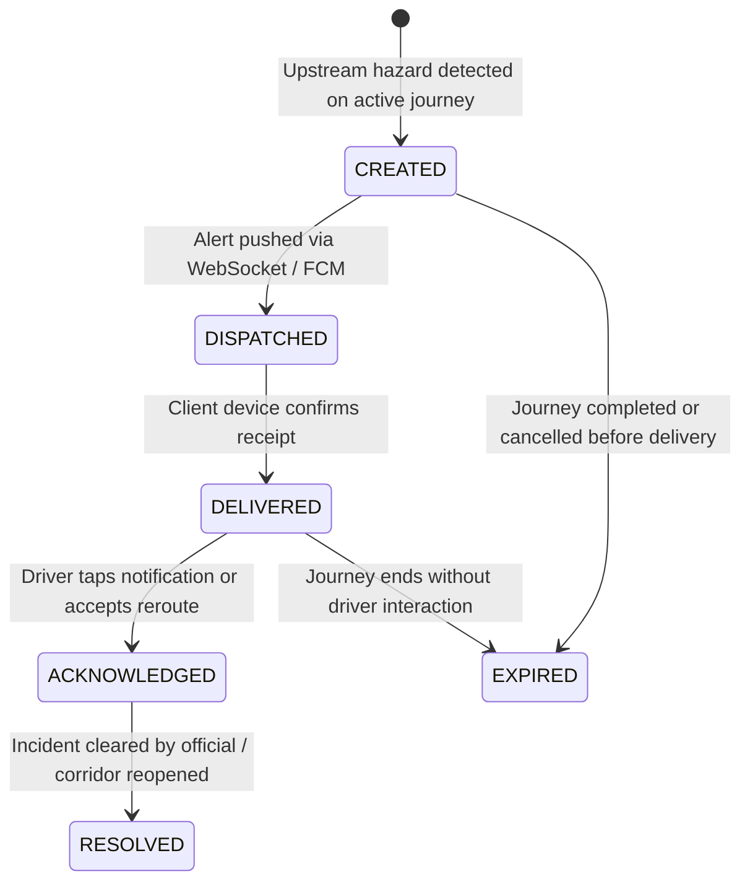

# Alert & Emergency Intelligence Specification — TiyraSense

**Document Status:** FINALIZED Specification (Phase 1)  
**Authoritative Architectural Rules:** Defined in `AGENTS.md` and `PROJECT_CONTEXT.md` §12

---

## 1. Alert Lifecycle & State Machine

Every alert transitions through an auditable lifecycle from hazard detection to resolution:



---

## 2. Dynamic Journey Geofence & Alert Targeting

TiyraSense **never spams all users with indiscriminate alerts.** Alerts are strictly targeted based on active spatial trajectories:

```
[HAZARD DETECTED]
Segment: NER-NH6-042 (Status -> BLOCKED)
       |
       v
[SPATIAL JOURNEY QUERY]
SELECT j.id, j.driver_id, j.current_location, ST_Distance(j.current_location, s.geom) as dist
FROM journeys j
JOIN routes r ON j.active_route_id = r.id
JOIN road_segments s ON s.id = 'NER-NH6-042'
WHERE j.status = 'ACTIVE'
  AND 'NER-NH6-042' = ANY(r.segment_ids);
       |
       v
[PROXIMITY FILTER]
Filter drivers heading toward hazard:
  - Immediate Danger Zone (0 to 5 km): CRITICAL / IMMEDIATE STOP
  - Safe Diversion Zone (5 to 30 km): WARNING / SUGGEST ALTERNATIVE REROUTE
  - Beyond Horizon (> 30 km): Informational queue / background route recalculation
```

---

## 3. Alert Severity Classifications

| Severity Level | Trigger Condition | Delivery Mechanism | In-App Driver Experience |
|---|---|---|---|
| **INFO** | Minor roadworks, lane narrowing, light rain ($< 15\text{ mm/hr}$) | WebSocket / In-app banner | Subtle visual badge, non-intrusive sound |
| **WARNING** | Mudslide on shoulder, waterlogging, moderate disruption probability ($> 0.40$) | High-priority push + Audio chime | Prominent amber modal, voice prompt, 1-tap diversion review |
| **CRITICAL** | Active landslide, bridge structural failure, complete highway blockage | Full-screen override + continuous haptic vibration | Red screen takeover, audible siren tone, automated safe bypass route loaded |
| **EMERGENCY_BROADCAST** | Government flash flood advisory, civil emergency, regional highway curfew | Corridor broadcast push + SMS | Persistent emergency banner, evacuation waypoint guidance |

---

## 4. Multilingual Advisory Synthesis (LLM Boundary)

To overcome language barriers for multi-state interstate freight drivers in the North East, alerts are dynamically translated and culturally contextualized:

### Supported Regional Languages
1. **English (`en`):** Standard administrative baseline.
2. **Assamese (`as`):** Primary language for Assam transit corridors (Brahmaputra valley).
3. **Bengali (`bn`):** Widely spoken across Southern Assam (Barak Valley), Tripura, and Meghalaya borders.
4. **Hindi (`hi`):** National interstate freight driver lingua franca.

### LLM Prompt Isolation Template
```text
SYSTEM INSTRUCTION:
You are an emergency road safety advisory assistant for the North Eastern Region of India.
Convert the structured hazard facts below into a single, direct, urgent, and compassionate warning sentence.
Keep it under 25 words. Do not speculate. Strictly use the provided facts.

INPUT FACTS:
- Hazard: {hazard_type}
- Location: {segment_name}
- Recommended Action: {action}
- Target Language: {lang_code}

OUTPUT SCHEMA: JSON {"advisory_text": "..."}
```

*Deterministic Fallback:* If Gemini API is unreachable, the system automatically uses pre-compiled static strings:
- *English:* "Hazard ahead at {location}. Road is {state}. Diversion recommended."
- *Hindi:* "{location} के पास खतरा। सड़क {state} है। कृपया डायवर्जन लें।"
- *Assamese:* "{location} ত বিপদ। পথ {state} হৈ আছে। অনুগ্ৰহ কৰি বিকল্প পথ লওক।"

---

## 5. Driver Interaction & Dynamic Rerouting

When a `WARNING` or `CRITICAL` alert triggers on the mobile app:
1. The app renders a **Hazard Interception Card** displaying:
   - Hazard type icon (e.g. Landslide / Flood).
   - Distance to obstruction (e.g. *18 km ahead near Nongpoh*).
   - Expected delay if blocked vs transit time on bypass.
2. **Action Buttons:**
   - **[ACCEPT SAFE REROUTE]** (Primary green action): Automatically applies the pre-evaluated bypass route to active navigation.
   - **[STAY ON CURRENT ROUTE]** (Requires explicit confirmation): Warns driver of high risk.
3. The response is recorded back to `POST /api/v1/journeys/{id}/reroute` for fleet dispatcher visibility.
