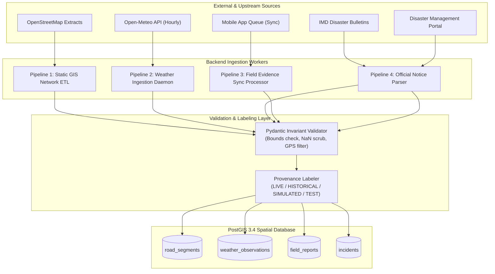

# Data Sources & Ingestion Pipelines Specification — TiyraSense

**Document Status:** FINALIZED Specification (Phase 1)  
**Authoritative Decisions:** D-008 (Segment-Centric), D-010 (OSM/MapLibre), D-011 (OSRM/PostGIS), D-012 (Open-Meteo/IMD), D-014 (Local PostGIS)

---

## 1. Upstream Data Source Inventory

To achieve high spatial fidelity in the North Eastern Region without commercial API licensing fees, TiyraSense integrates four distinct categories of data:

```
+---------------------------------------------------------------------------------------------------+
| 1. Geospatial & Road Network Data                                                                 |
|    - Provider: OpenStreetMap (OSM) via Geofabrik North-East India Extract & Overpass API         |
|    - License: Open Database License (ODbL) - 100% Free / Open Source                              |
|    - Payload: Highway linestrings, surface type, bridges, tunnels, administrative borders        |
+---------------------------------------------------------------------------------------------------+
| 2. Meteorological & Hydro-Weather Data                                                            |
|    - Primary Provider: Open-Meteo API (ECMWF & GFS numerical models, 1-11 km grid)                |
|    - Secondary Provider: IMD (India Meteorological Department) RMC Guwahati District Bulletins     |
|    - Cost / Key: 100% Free for non-commercial/academic use, Zero API Key required                |
|    - Payload: Precipitation (mm/hr), soil moisture saturation (%), surface pressure, wind gust   |
+---------------------------------------------------------------------------------------------------+
| 3. Ground-Truth Field Evidence & Crowd Telemetry                                                  |
|    - Provider: TiyraSense Flutter Mobile Network (Drivers & Checkpoint Field Workers)             |
|    - Protocol: Offline-first queued sync with tamper-evident hardware timestamps & GPS points     |
|    - Payload: Landslides, mudslides, waterlogging, bridge distress, photo hashes                 |
+---------------------------------------------------------------------------------------------------+
| 4. Official Government Dispatches & Border Road Bulletins                                         |
|    - Providers: ASDMA (Assam State Disaster Management Authority), BRO (Project Vartak/Pushpak)  |
|    - Ingestion Mode: Structured RSS / JSON scraping and official portal webhooks                  |
|    - Payload: Executive road closure orders, convoy curfews, scheduled earthmoving clearances   |
+---------------------------------------------------------------------------------------------------+
```

---

## 2. Ingestion Pipeline Architecture



---

## 3. Pipeline Specifications

### Pipeline 1: Static GIS Network ETL (`scripts/seed_corridor_data.py`)
- **Frequency:** On-demand / Initial deployment.
- **Process:**
  1. Downloads the North-East India OSM extract (`india-latest.osm.pbf`) or queries Overpass API for `highway IN (motorway, trunk, primary, secondary, tertiary)` within the pilot bounding box ($[25.5^\circ \text{N}, 26.3^\circ \text{N}]$, $[91.5^\circ \text{E}, 92.0^\circ \text{E}]$).
  2. Splits long continuous ways into atomic $\sim 500\text{m} - 2000\text{m}$ road segments.
  3. Computes topological start and end nodes for graph connectivity.
  4. Intersects segment line with digital elevation contours to calculate `average_slope_degrees`.
  5. Inserts into `road_segments` with unique `segment_code` (e.g. `NER-NH6-001` to `NER-NH6-065`).

### Pipeline 2: Weather Ingestion Daemon (`backend/workers/weather_ingestion.py`)
- **Frequency:** Cron schedule every 30 minutes.
- **Process:**
  1. Identifies monitoring centroids along active corridors (5 sampling points between Guwahati and Shillong: Khanapara, Jorabat, Nongpoh, Umsning, Umiam).
  2. Dispatches asynchronous HTTP GET requests to Open-Meteo:
     ```http
     GET https://api.open-meteo.com/v1/forecast?latitude=25.90&longitude=91.88&hourly=precipitation,soil_moisture_0_to_7cm,wind_gusts_10m,weather_code&forecast_days=2
     ```
  3. Parses response array; maps coordinates to nearest `road_segment_id` within 5 km buffer.
  4. Writes validated records to `weather_observations` with `forecast_horizon_hours`.
  5. Triggers automatic risk recalculation for impacted segments if rainfall $> 25\text{ mm/hr}$.

### Pipeline 3: Field Evidence Sync Processor (`backend/api/v1/reports.py`)
- **Frequency:** Real-time event-driven via HTTP POST.
- **Process:**
  1. Receives single report or multi-item offline sync batch from mobile app.
  2. Validates user JWT authentication and client timestamp plausibility ($\Delta t \le \text{server\_time} + 120\text{s}$).
  3. Executes spatial query: `ST_ClosestPoint(s.geom, ST_SetSRID(ST_Point(lon, lat), 4326))` to identify matching segment.
  4. Writes raw report to `field_reports`.
  5. Dispatches event to **Conflict Resolution Engine** to evaluate if segment accessibility state must transition.

### Pipeline 4: Official Notice Parser & Override (`backend/workers/official_notices.py`)
- **Frequency:** Hourly poll + instant manual UI submission.
- **Process:**
  1. Scrapes or ingests ASDMA bulletin updates and Border Roads Organisation (BRO) press releases.
  2. Identifies mentioned National Highways (e.g. "NH-6 closed at km 48 due to bridge repair").
  3. Flags impacted segment range as `RESTRICTED` or `BLOCKED`.
  4. Assigns `reliability_weight = 1.0` (official ground truth).
  5. Broadcasts corridor alert to active journey monitors.

---

## 4. Data Labeling & Environment Separation Policy

To enforce `AGENTS.md` absolute rules against presenting fake data as live:

| Label | Permitted Source | Use Case | UI Rendering Rule |
|---|---|---|---|
| **`LIVE`** | Authenticated mobile user GPS, real-time Open-Meteo API, live official bulletin | Normal production runtime | Standard UI display |
| **`HISTORICAL`** | Archived weather databases, past monsoon landslide records (2020–2024) | ML model training & baseline calibration | Marked with historical badge and timestamp |
| **`SIMULATED`** | Synthetic event generator (`scripts/simulate_disruption.py`) | Hackathon jury demonstration, disaster scenario drills | **Mandatory high-visibility amber badge: [SIMULATED DATA]** |
| **`TEST`** | Pytest fixtures and mock test datasets | Automated test suite | Never visible in production UI; isolated in test DB |

---

## 5. Rate Limits, Backoff & Error Resilience

- **Open-Meteo Resilience:** Open-Meteo allows up to 10,000 daily calls on free tier. TiyraSense batches requests across 5 corridor centroids every 30 minutes ($5 \times 48 = 240\text{ calls/day} \implies 2.4\%$ of quota).
- **HTTP Backoff:** Automatic exponential backoff with jitter on 429/503 responses:
  $$\text{Delay} = \min(60, 2^{\text{retry\_count}}) + \text{random}(0, 1)$$
- **Staleness Fallback:** If weather API fails for $> 2$ consecutive cycles, the system retains the last known weather observation for up to 3 hours while decaying risk confidence, and flags a system health warning on the admin dashboard.
