# Offline Operation & Data Synchronization Specification — TiyraSense

**Document Status:** FINALIZED Specification (Phase 1)  
**Authoritative Decision:** D-009 (Offline-First Mobile Operation)  
**Client Technology:** Flutter (Dart) + SQLite (`sqflite` / `drift`) + `flutter_map_cache`

---

## 1. Operating Philosophy in NER Connectivity Dead Zones

Mountain logistics in the North Eastern Region routinely pass through deep river gorges, densely forested ridges, and international border tracts with zero cellular signal (EDGE/3G/4G/5G). 

**TiyraSense treats offline execution as the standard operational baseline, not an exceptional error state.**
- A driver must be able to view their journey route, navigate corridor waypoints, and report incidents without network access.
- A field worker must be able to capture observations, attach photos, and queue hazard reports completely offline.
- Data synchronization must trigger opportunistically in the background the moment connectivity is detected, without user intervention.

---

## 1.1 Client Credential & Session Persistence Architecture (Decision D-017)

To ensure operational reliability when starting the mobile application in areas with zero network connectivity:
1. **OS Secure Enclave Encryption:** The JWT token and cached `UserModel` are stored via `flutter_secure_storage` backed by the Android Keystore (AES-GCM encryption) and iOS Keychain. Plaintext disk storage (`shared_preferences`) is banned for sensitive auth data.
2. **Cold-Start Pre-Frame Restoration:** The app awaits credential restoration during `main()` before rendering the initial widget tree. If a valid cached session exists, the app navigates immediately to `DriverHomeScreen` or `FieldWorkerHomeScreen`.
3. **Offline Launch Resilience:** If the device boots without cellular reception or the backend is unreachable, the cached session is preserved. Local credentials are only cleared upon an explicit user "Sign Out" tap or an authoritative HTTP 401/403 status code from the server.

---

## 2. Client-Side SQLite Storage Architecture

The mobile client maintains a persistent local SQLite database containing five core tables:

```sql
-- 1. Pre-cached route geometries and corridor waypoints
CREATE TABLE local_routes (
    id TEXT PRIMARY KEY,
    origin_name TEXT NOT NULL,
    destination_name TEXT NOT NULL,
    polyline_geojson TEXT NOT NULL,
    total_distance_km REAL NOT NULL,
    estimated_duration_mins REAL NOT NULL,
    cached_at INTEGER NOT NULL, -- Unix epoch ms
    is_active INTEGER NOT NULL DEFAULT 0
);

-- 2. Offline queued incident reports pending server upload
CREATE TABLE offline_reports_queue (
    client_uuid TEXT PRIMARY KEY,
    hazard_type TEXT NOT NULL,
    severity TEXT NOT NULL,
    description TEXT,
    latitude REAL NOT NULL,
    longitude REAL NOT NULL,
    accuracy_meters REAL,
    photo_local_path TEXT,
    client_captured_at INTEGER NOT NULL, -- Device UTC epoch ms
    sync_status TEXT NOT NULL DEFAULT 'PENDING', -- PENDING, SYNCING, SYNCED, FAILED
    retry_count INTEGER NOT NULL DEFAULT 0,
    last_error TEXT
);

-- 3. Cached active incidents and hazards along corridor
CREATE TABLE local_incident_cache (
    id TEXT PRIMARY KEY,
    road_segment_id TEXT NOT NULL,
    hazard_type TEXT NOT NULL,
    severity TEXT NOT NULL,
    accessibility_impact TEXT NOT NULL,
    latitude REAL NOT NULL,
    longitude REAL NOT NULL,
    received_at INTEGER NOT NULL
);

-- 4. Cached active segment accessibility states
CREATE TABLE local_segment_states (
    segment_id TEXT PRIMARY KEY,
    segment_code TEXT NOT NULL,
    current_accessibility TEXT NOT NULL,
    risk_score REAL NOT NULL,
    updated_at INTEGER NOT NULL
);

-- 5. Outbound breadcrumb buffer
CREATE TABLE local_telemetry_buffer (
    id INTEGER PRIMARY KEY AUTOINCREMENT,
    journey_id TEXT NOT NULL,
    latitude REAL NOT NULL,
    longitude REAL NOT NULL,
    speed_kmh REAL,
    heading_degrees REAL,
    timestamp INTEGER NOT NULL,
    synced INTEGER NOT NULL DEFAULT 0
);
```

---

## 3. Map Tile Pre-Caching Strategy

1. **Bounding Box Strategy:** When a driver inputs a journey (e.g. Guwahati $\leftrightarrow$ Shillong), the app identifies the corridor envelope:
   - Latitude: $[25.40^\circ \text{N}, 26.35^\circ \text{N}]$
   - Longitude: $[91.45^\circ \text{E}, 92.15^\circ \text{E}]$
2. **Zoom Level Hierarchy:**
   - Regional Overview (Zoom 8–11): Fully cached for the entire state of Assam & Meghalaya ($\sim 15\text{ MB}$).
   - Corridor Detail (Zoom 12–15): Pre-cached along the 5 km corridor buffer of the active route ($\sim 35\text{ MB}$).
3. **Storage Engine:** `flutter_map_cache` with a dedicated SQLite BLOB tile store. Tiles older than 14 days are opportunistically purged during WiFi connectivity.

---

## 4. Background Sync & Reconciliation Protocol

### 4.1 Trigger Conditions
The sync engine activates under three conditions:
1. `connectivity_plus` broadcast detects a transition from `none` $\rightarrow$ `mobile` or `wifi`.
2. App lifecycle transition to `resumed`.
3. Periodic foreground timer (every 60 seconds while active journey is running).

### 4.2 Queue Processing Lifecycle

```mermaid
stateDiagram-v2
    [*] --> PENDING: Report saved to local SQLite
    PENDING --> SYNCING: Connectivity detected; HTTP payload built
    SYNCING --> SYNCED: Server returns HTTP 200/202 with report_id
    SYNCING --> FAILED: Network drops or HTTP 5xx error
    FAILED --> PENDING: Exponential backoff timer expires (2s, 4s, 8s, max 60s)
    SYNCED --> [*]: Record flagged for cleanup (retained 48h for audit)
```



### 4.3 Multipart Evidence Upload
If a report contains photo evidence:
1. Report metadata is transmitted first via `POST /api/v1/reports`.
2. On success, the image file is streamed via `POST /api/v1/reports/{id}/evidence`.
3. If the image upload fails due to weak bandwidth, the text metadata remains accepted on the server, ensuring hazard warnings propagate even if images lag behind.

---

## 5. Timestamp Discipline & Tamper Prevention

To protect against device clock drift or malicious timestamp manipulation:
1. **Triple-Timestamp Validation:**
   - `client_captured_at`: Recorded from device hardware clock when user taps submit.
   - `device_uptime_ms`: Monotonic hardware boot tick count (immune to system time edits).
   - `server_received_at`: Authoritative NTP server time when payload reaches backend.
2. **Plausibility Window:**
   - If `client_captured_at > server_received_at + 120 seconds`, client clock is flagged as drifting into future; server clamps capture time to `server_received_at`.
   - Reports with `client_captured_at < server_received_at - 7 days` are rejected as stale.
