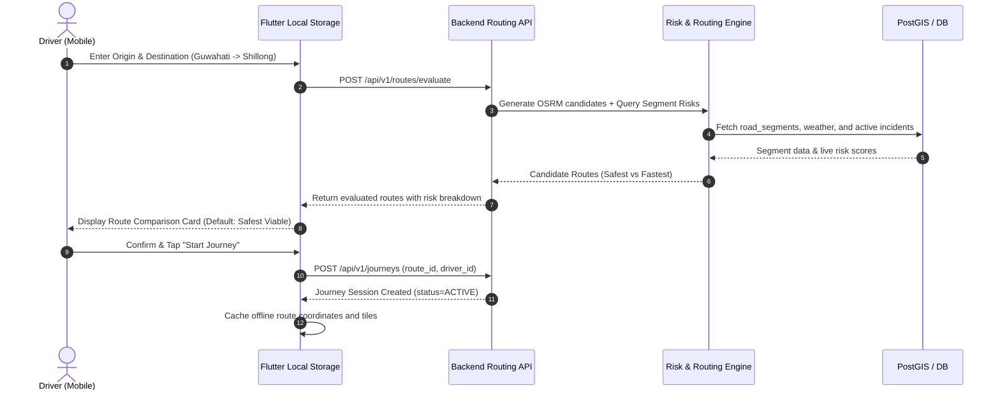
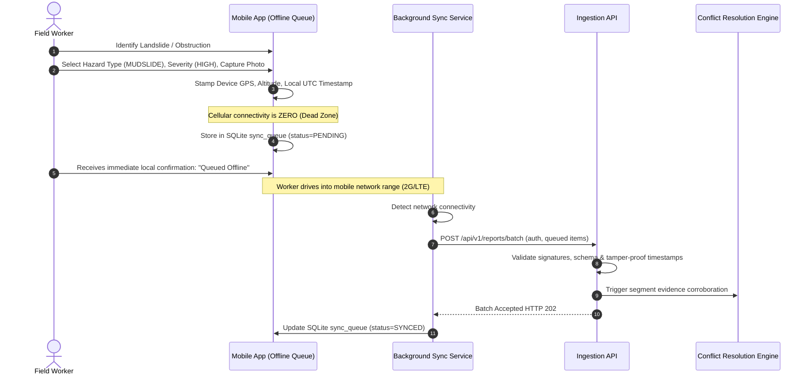

# User Roles & Interaction Flows — TiyraSense

**Document Status:** FINALIZED Specification (Phase 1)  
**Module Alignment:** Mobile (`mobile/`), Web (`web/`), Backend RBAC (`backend/`)

---

## 1. Role Definitions & Permissions Matrix

TiyraSense enforces strict server-side Role-Based Access Control (RBAC). Client-side flags only tailor UI visibility; all privileges are validated per-request at the API gateway.

| Role | Target Client | Key Responsibilities | Access Level |
|---|---|---|---|
| **DRIVER** | Mobile App | Operates four-wheeler freight/transit vehicles; views safety-first routes; receives targeted hazard alerts; submits quick one-tap incident reports. | Read routes, create own journeys, submit reports, receive personal alerts. |
| **FIELD_WORKER** | Mobile App | Stationed in field sectors; inspects road condition, physical blockages, weather severity; submits verified geotagged reports with photo evidence. | Extended report submission (severity, structural damage), offline queue sync. |
| **OFFICIAL** | Web Portal | Regional transport / disaster authority; monitors live corridor states; reviews and verifies pending community reports; creates manual override advisories. | Review reports, override segment accessibility state, broadcast regional alerts. |
| **ADMIN** | Web Portal | System management; configures seed corridor graphs; monitors data pipeline health and model versions; reviews audit logs. | Full system administration, user management, audit review. |

### Permissions Grid

| Resource / Capability | DRIVER | FIELD_WORKER | OFFICIAL | ADMIN |
|---|:---:|:---:|:---:|:---:|
| `routes:evaluate` | ✅ | ✅ | ✅ | ✅ |
| `journeys:start_track` | ✅ | ❌ | ❌ | ✅ |
| `reports:submit_basic` | ✅ | ✅ | ✅ | ✅ |
| `reports:submit_evidence` | ❌ | ✅ | ✅ | ✅ |
| `reports:verify_override` | ❌ | ❌ | ✅ | ✅ |
| `segments:update_state` | ❌ | ❌ | ✅ | ✅ |
| `alerts:broadcast_manual` | ❌ | ❌ | ✅ | ✅ |
| `admin:manage_network` | ❌ | ❌ | ❌ | ✅ |

---

## 2. Interaction Flows

### Flow 1: Driver Route Planning & Monitored Journey



---

### Flow 2: Offline-First Field Incident Reporting



---

### Flow 3: Upstream Incident Alert & Dynamic Rerouting

```mermaid
sequenceDiagram
    autonumber
    participant System as Journey Monitor Worker
    participant Risk as Risk Assessment Engine
    participant Gemini as Multilingual Advisory Service
    participant Driver as Driver Mobile App

    System->>Risk: Segment NER-NH6-042 transitions to BLOCKED
    System->>System: Query active journeys intersecting NER-NH6-042
    System->>System: Identify Journey #8921 (Driver 18km upstream)
    System->>Risk: Compute alternative bypass from current coordinate
    System->>Gemini: Generate advisory prompt (Lang: Assamese + English)
    Gemini-->>System: "Landslide at Nongpoh. Divert via Umsning bypass (+15 mins)."
    System->>Driver: Push High-Priority Hazard Alert (WebSocket / Push Notification)
    Driver->>Driver: Audible chime + Vibration alert
    Driver->>Driver: Visual prompt: [Accept Safe Reroute] vs [View Details]
    Driver->>Driver: Tap [Accept Safe Reroute]
    Driver->>System: POST /api/v1/journeys/8921/reroute (new_route_id)
    System-->>Driver: Journey route updated; turn-by-turn guidance adapts
```

---

### Flow 4: Disaster Official Verification & Advisory Broadcast

1. Official logs into the Web Portal via secure credentials.
2. Web Dashboard displays the GIS map with color-coded road segments (`GREEN`: Open, `YELLOW`: Caution, `ORANGE`: Restricted, `RED`: Blocked).
3. A notification highlights an unverified high-severity report submitted by field workers near Jorabat.
4. Official reviews attached photos, timestamp, and corroborating weather radar (rain > 40 mm/hr).
5. Official clicks **Verify & Apply Closure**:
   - Backend updates `road_segments.accessibility_state` to `BLOCKED`.
   - Audit trail records `verified_by_user_id` and timestamp.
6. Official enters a broadcast advisory text; chooses target corridor radius.
7. Alert engine distributes the advisory to all fleet managers and drivers scheduled to traverse NH-6.

---

## 3. Degraded & Failure Mode Handling

- **Total Network Blackout:** Mobile app displays cached map tiles, warns driver that live telemetry is suspended, but maintains navigation along the pre-downloaded corridor geometry.
- **Corroboration Fallback:** If an unverified driver report claims a road is blocked without secondary evidence, the system elevates the segment to `CAUTION` with high uncertainty, alerting nearby dispatchers rather than shutting down the arterial corridor prematurely.
- **GPS Loss / Tunnel Transit:** App extrapolates last known velocity and dead-reckoning along the road segment geometry until satellite lock is re-acquired.
